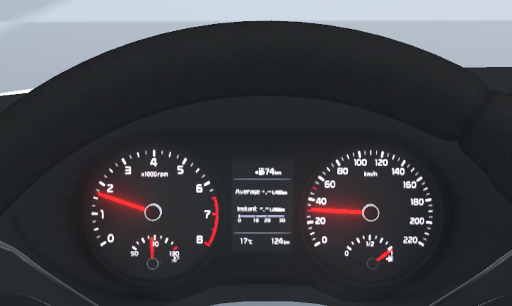

# Car driving simulator

Implementation of an interactive simulation with the cars.

# Car physics

The application implements some features of the physics of driving a car. For example, a simulation of an engine and an automatic transmission that shifts gears to optimize rpm and torque delivered to the wheels.

